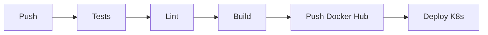

# 🌬️ Air Quality Dashboard France

> Dashboard interactif de visualisation de la qualité de l'air en France avec pipeline CI/CD complet et déploiement Kubernetes.


---

## 📋 Description

Application web complète pour visualiser et analyser les données de qualité de l'air en France. Le projet comprend :

- **Dashboard interactif** : Visualisations des polluants (NO2, PM10, PM2.5, O3)
- **Carte interactive** : Carte Leaflet.js avec marqueurs colorés
- **API REST** : Endpoints CRUD et statistiques avec FastAPI
- **Pipeline CI/CD** : Automatisation complète avec GitHub Actions
- **Déploiement K8s** : Manifestes Kubernetes prêts pour production

---

## 🛠️ Stack Technique

| Composant | Technologie |
|-----------|-------------|
| **Backend** | FastAPI, SQLAlchemy, PostgreSQL |
| **Frontend** | HTML5, CSS3, JavaScript, Chart.js, Leaflet.js |
| **Conteneurs** | Docker, Docker Compose |
| **Orchestration** | Kubernetes (Minikube / AKS / EKS / GKE) |
| **CI/CD** | GitHub Actions |
| **Tests** | Pytest, Coverage |

---

## 🏗️ Architecture

```
┌─────────────────────────────────────────────────────────────┐
│                   KUBERNETES CLUSTER                         │
│  ┌─────────────┐  ┌─────────────┐  ┌─────────────────┐     │
│  │  Frontend   │  │   Backend   │  │   PostgreSQL    │     │
│  │   Nginx     │──│   FastAPI   │──│    Database     │     │
│  │   :80       │  │   :8000     │  │    :5432        │     │
│  └─────────────┘  └─────────────┘  └─────────────────┘     │
│         │                                                    │
│         └───────────► LoadBalancer Service                  │
└─────────────────────────────────────────────────────────────┘
                          ▲
                          │ GitHub Actions
                          │ CI/CD Pipeline
                    ┌─────┴─────┐
                    │  GitHub   │
                    │  + Docker │
                    │    Hub    │
                    └───────────┘
```

---

## 📂 Structure du Projet

```
air-quality-dashboard/
├── .github/
│   └── workflows/
│       └── ci-cd.yaml           # Pipeline CI/CD
├── backend/
│   ├── app/
│   │   ├── __init__.py
│   │   ├── main.py              # FastAPI app
│   │   ├── models.py            # SQLAlchemy models
│   │   ├── schemas.py           # Pydantic schemas
│   │   ├── crud.py              # Opérations CRUD
│   │   ├── database.py          # Config DB
│   │   └── routers/
│   │       ├── air_quality.py   # Endpoints données
│   │       └── stats.py         # Endpoints stats
│   ├── tests/
│   │   └── test_api.py          # Tests unitaires
│   ├── requirements.txt
│   └── Dockerfile
├── frontend/
│   ├── index.html               # Dashboard UI
│   ├── css/
│   │   └── style.css            # Styles dark theme
│   ├── js/
│   │   ├── api.js               # Client API
│   │   ├── app.js               # Application principale
│   │   └── charts.js            # Graphiques Chart.js
│   ├── nginx.conf
│   └── Dockerfile
├── k8s/
│   ├── namespace.yaml
│   ├── postgres/
│   │   ├── secret.yaml
│   │   ├── pvc.yaml
│   │   ├── deployment.yaml
│   │   └── service.yaml
│   ├── backend/
│   │   ├── configmap.yaml
│   │   ├── deployment.yaml
│   │   └── service.yaml
│   └── frontend/
│       ├── deployment.yaml
│       └── service.yaml
├── docker-compose.yaml          # Dev local
├── roadmap_simple.png           # Roadmap projet
└── README.md
```

---

## 🚀 Démarrage Rapide

### Prérequis

- Docker & Docker Compose
- Python 3.11+
- Node.js (optionnel, pour dev frontend)
- kubectl & Minikube (pour K8s)

### Option 1: Docker Compose (Recommandé pour dev)

```bash
# Cloner le repo
git clone https://github.com/USERNAME/air-quality-dashboard.git
cd air-quality-dashboard

# Lancer tous les services
docker-compose up -d

# Accéder à l'application
# Frontend: http://localhost:80
# API Docs: http://localhost:8000/docs
```

### Option 2: Développement Local

```bash
# Backend
cd backend
python -m venv venv
source venv/bin/activate  # Linux/Mac
# ou: venv\Scripts\activate  # Windows
pip install -r requirements.txt
uvicorn app.main:app --reload --port 8000

# Frontend (autre terminal)
cd frontend
python -m http.server 8080
# Ou utiliser Live Server dans VS Code
```

### Option 3: Kubernetes (Minikube)

```bash
# Démarrer Minikube
minikube start --driver=docker --memory=4096

# Appliquer les manifestes
kubectl apply -f k8s/namespace.yaml
kubectl apply -f k8s/postgres/
kubectl apply -f k8s/backend/
kubectl apply -f k8s/frontend/

# Attendre que les pods soient prêts
kubectl get pods -n air-quality -w

# Accéder au frontend
minikube service frontend -n air-quality
```

---

## 📊 Fonctionnalités

### Dashboard
- **Vue d'ensemble** : Cartes statistiques pour chaque polluant
- **Graphiques** : Évolution temporelle et comparaison régionale
- **Filtres** : Par région, commune et année

### Carte Interactive
- **Marqueurs colorés** : Vert/Jaune/Rouge selon les seuils OMS
- **Popup détaillés** : Informations sur hover
- **Filtres** : Sélection polluant et année

### API REST
- `GET /api/v1/records` - Liste des mesures (filtrable)
- `GET /api/v1/records/{id}` - Détail d'une mesure
- `POST /api/v1/records` - Créer une mesure
- `PUT /api/v1/records/{id}` - Modifier une mesure
- `DELETE /api/v1/records/{id}` - Supprimer une mesure
- `GET /api/v1/regions` - Liste des régions
- `GET /api/v1/communes` - Liste des communes
- `GET /api/v1/stats/region/{region}` - Stats par région
- `GET /api/v1/trends/{pollutant}` - Tendances temporelles

---

## 🧪 Tests

```bash
cd backend

# Lancer les tests
pytest tests/ -v

# Avec couverture
pytest tests/ -v --cov=app --cov-report=html

# Ouvrir le rapport de couverture
open htmlcov/index.html
```

---

## 🔧 Configuration

### Variables d'environnement

| Variable | Description | Défaut |
|----------|-------------|--------|
| `DATABASE_URL` | URL PostgreSQL | `sqlite:///./data/air_quality.db` |
| `ENVIRONMENT` | Environnement (dev/prod) | `development` |
| `LOG_LEVEL` | Niveau de log | `INFO` |
| `CORS_ORIGINS` | Origins CORS autorisés | `*` |

### Secrets Kubernetes

```bash
# Créer le secret pour Docker Hub
kubectl create secret docker-registry regcred \
  --docker-server=https://index.docker.io/v1/ \
  --docker-username=USERNAME \
  --docker-password=TOKEN \
  -n air-quality
```

### Secrets GitHub Actions

| Secret | Description |
|--------|-------------|
| `DOCKER_HUB_USERNAME` | Nom d'utilisateur Docker Hub |
| `DOCKER_HUB_TOKEN` | Token d'accès Docker Hub |
| `KUBE_CONFIG` | Kubeconfig encodé en base64 |

---

## 📈 Pipeline CI/CD

Le pipeline s'exécute automatiquement sur chaque push vers `main`:

1. **Test** : Exécution des tests pytest avec couverture
2. **Lint** : Vérification du code (flake8, black, bandit)
3. **Build** : Construction des images Docker
4. **Push** : Publication sur Docker Hub
5. **Deploy** : Déploiement sur Kubernetes



---

## 📊 Données

### Source
Les données proviennent de [Zenodo](https://zenodo.org/records/5043645) :
- **Période** : 2000-2015 (hors 2006)
- **Couverture** : Toutes les communes de France métropolitaine
- **Polluants** : NO2, PM10, PM2.5, O3, SOMO35, AOT40

### Base de données
- **PostgreSQL** pour la production
- **SQLite** pour le développement local

---

## 🔒 Sécurité

- ✅ Conteneurs non-root
- ✅ Secrets Kubernetes pour les credentials
- ✅ CORS configuré
- ✅ Validation des entrées (Pydantic)
- ✅ Protection contre les injections SQL (ORM)
- ✅ Rate limiting Nginx
- ✅ Security headers

---

## 👥 Équipe

| Nom | Rôle |
|-----|------|
| **Clem** | Backend & DevOps |
| **Willou** | Frontend & Data |

**Cours** : DevOps for SWE - Badr TAJINI - ESIEE Paris  
**Deadline** : 01/02/2026

---

## 📚 Ressources

- [FastAPI Documentation](https://fastapi.tiangolo.com/)
- [Kubernetes Basics](https://kubernetes.io/docs/tutorials/kubernetes-basics/)
- [GitHub Actions](https://docs.github.com/en/actions)
- [Docker Compose](https://docs.docker.com/compose/)
- [Chart.js](https://www.chartjs.org/)
- [Leaflet.js](https://leafletjs.com/)

---

## 📄 License

MIT License - Voir [LICENSE](LICENSE) pour plus de détails.

---

*Développé avec ❤️ pour le cours DevOps ESIEE Paris 2025-2026*
